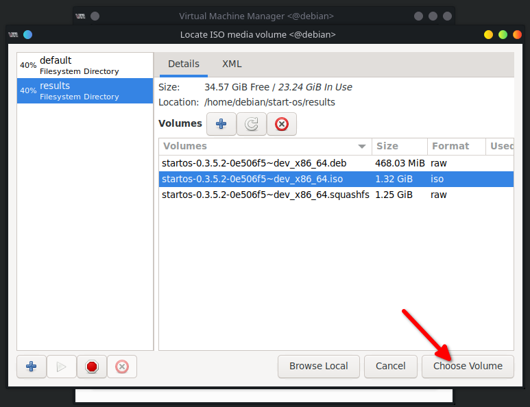
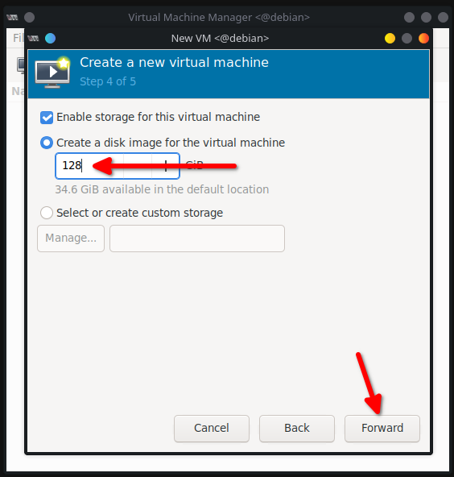

# Setting up your development environment on Debian/Ubuntu

A step-by-step guide

> This is the only officially supported build environment.
> MacOS has limited build capabilities and Windows requires [WSL2](https://learn.microsoft.com/en-us/windows/wsl/install)

## Installing dependencies

Run the following commands one at a time

```sh
sudo apt update
sudo apt install -y ca-certificates curl gpg build-essential
curl -fsSL https://download.docker.com/linux/debian/gpg | sudo gpg --dearmor -o /usr/share/keyrings/docker-archive-keyring.gpg
echo "deb [arch=$(dpkg-architecture -q DEB_HOST_ARCH) signed-by=/usr/share/keyrings/docker-archive-keyring.gpg] https://download.docker.com/linux/debian bookworm stable" | sudo tee /etc/apt/sources.list.d/docker.list
sudo apt update
sudo apt install -y sed grep gawk jq gzip brotli containerd.io docker-ce docker-ce-cli docker-compose-plugin qemu-user-static binfmt-support squashfs-tools git debspawn rsync b3sum
sudo mkdir -p /etc/debspawn/
echo "AllowUnsafePermissions=true" | sudo tee /etc/debspawn/global.toml
sudo usermod -aG docker $USER
sudo su $USER
docker run --privileged --rm tonistiigi/binfmt --install all
docker buildx create --use
curl --proto '=https' --tlsv1.2 -sSf https://sh.rustup.rs | sh # proceed with default installation
curl -o- https://raw.githubusercontent.com/nvm-sh/nvm/master/install.sh | bash
source ~/.bashrc
nvm install 20
nvm use 20
```

## Cloning the repository

```sh
git clone --recursive https://github.com/Start9Labs/start-os.git --branch next/minor
cd start-os
```

## Building an ISO

```sh
PLATFORM=$(uname -m) ENVIRONMENT=dev make iso
```

This will build an ISO for your current architecture. If you are building to run on an architecture other than the one you are currently on, replace `$(uname -m)` with the correct platform for the device (one of `aarch64`, `aarch64-nonfree`, `x86_64`, `x86_64-nonfree`, `raspberrypi`)

## Creating a VM

### Install virt-manager

```sh
sudo apt update
sudo apt install -y virt-manager
sudo usermod -aG libvirt $USER
sudo su $USER
```

### Launch virt-manager

```sh
virt-manager
```

### Create new virtual machine


#### make sure to set "Target Path" to the path to your results directory in start-os








## Updating a VM

The fastest way to update a VM to your latest code depends on what you changed:

### UI or startd:

```sh
PLATFORM=$(uname -m) ENVIRONMENT=dev make update-startbox REMOTE=start9@<VM IP>
```

### Container runtime or debian dependencies:

```sh
PLATFORM=$(uname -m) ENVIRONMENT=dev make update-deb REMOTE=start9@<VM IP>
```

### Image recipe:

```sh
PLATFORM=$(uname -m) ENVIRONMENT=dev make update-squashfs REMOTE=start9@<VM IP>
```

---

If the device you are building for is not available via ssh, it is also possible to use `magic-wormhole` to send the relevant files.

### Prerequisites:

```sh
sudo apt update
sudo apt install -y magic-wormhole
```

As before, the fastest way to update a VM to your latest code depends on what you changed. Each of the following commands will return a command to paste into the shell of the device you would like to upgrade.

### UI or startd:

```sh
PLATFORM=$(uname -m) ENVIRONMENT=dev make wormhole
```

### Container runtime or debian dependencies:

```sh
PLATFORM=$(uname -m) ENVIRONMENT=dev make wormhole-deb
```

### Image recipe:

```sh
PLATFORM=$(uname -m) ENVIRONMENT=dev make wormhole-squashfs
```
