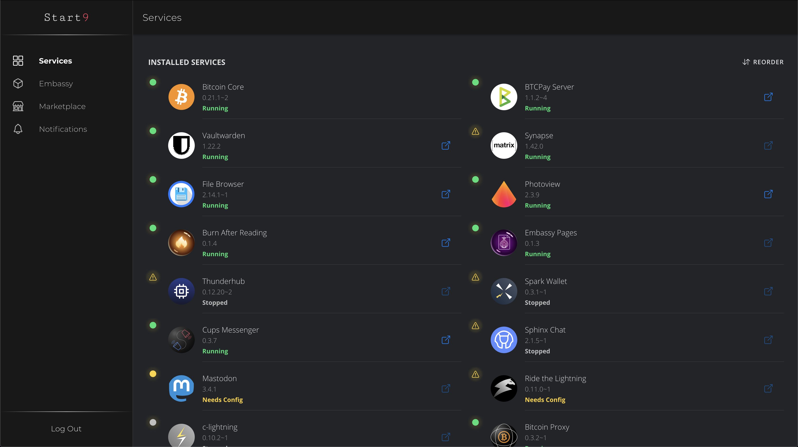
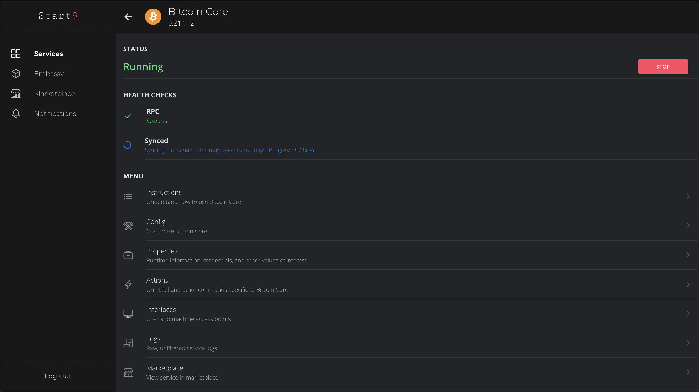
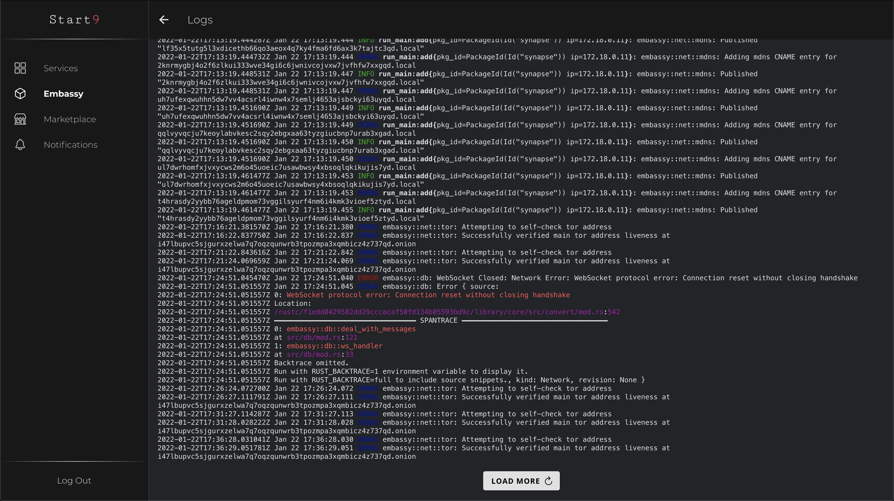

# EmbassyOS

### _Welcome to the era of Sovereign Computing_ ###

EmbassyOS is a browser-based, graphical operating system for a personal server. EmbassyOS facilitates the discovery, installation, network configuration, service configuration, data backup, dependency management, and health monitoring of self-hosted software services. It is the most advanced, secure, reliable, and user friendly personal server OS in the world.

## Running EmbassyOS
There are multiple ways to get your hands on EmbassyOS.

### :moneybag: Buy an Embassy
This is the most convenient option. Simply [buy an Embassy](https://start9.com) from Start9 and plug it in. Depending on where you live, shipping costs and import duties will vary.

### :construction_worker: Build your own Embassy
While not as convenient as buying an Embassy, this option is easier than you might imagine, and there are 4 reasons why you might prefer it:
1. You already have a Raspberry Pi and would like to re-purpose it.
1. You want to save on shipping costs.
1. You prefer not to divulge your physical address.
1. You just like building things.

To pursue this option, follow this [guide](https://start9.com/latest/diy).

### :hammer_and_wrench: Build EmbassyOS from Source

EmbassyOS can be built from source, for personal use, for free.
A detailed guide for doing so can be found [here](https://github.com/Start9Labs/embassy-os/blob/master/build/README.md).

## :heart: Contributing
There are multiple ways to contribute: work directly on EmbassyOS, package a service for the marketplace, or help with documentation and guides. To learn more about contributing, see [here](https://github.com/Start9Labs/embassy-os/blob/master/CONTRIBUTING.md).

## UI Screenshots

 

