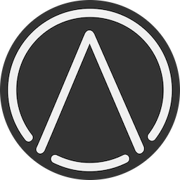

<div align="center">
  
  <h1 style="margin-top: 0;">Start9 Monorepo</h1>
  <a href="https://github.com/Start9Labs/start-os/releases">
    
  </a>
  <a href="https://github.com/Start9Labs/start-os/actions/workflows/startos-iso.yaml">
    
  </a>
  <a href="https://docs.start9.com">
    
  </a>
  <a href="https://matrix.to/#/#dev-startos:matrix.start9labs.com">
    
  </a>
  <a href="https://start9.com">
    
  </a>
</div>

## What is this?

This repository is the **monorepo for all Start9 products**. Its flagship is **StartOS** — an open-source Linux distribution for running a personal server, handling discovery, installation, network configuration, data backup, dependency management, and health monitoring of self-hosted services.

All products share a single Rust backend library (`start-core`) and a single Angular workspace; each product is a thin top-level wrapper that adds only its own entry point and any product-specific frontend or packaging.

| Directory | Product | What it is |
|---|---|---|
| `start-os/` | StartOS | The server OS — `startbox`/`start-container` bins, web UI + setup wizard, container runtime, OS packaging |
| `start-cli/` | start-cli | CLI for managing servers, registries, and packaging |
| `start-registry/` | start-registry | Package registry server (`registrybox`); serves the marketplace UI |
| `start-tunnel/` | StartTunnel | VPN/forwarding server (`tunnelbox`) + its web UI |
| `start-sdk/` | Start SDK | `@start9labs/start-sdk` for building StartOS service packages |
| `brochure/` | brochure | Marketing/landing site |
| `shared/crates/start-core/` | — | The entire Rust backend library shared by all bins |
| `shared/web/` | — | Single Angular workspace + shared libraries |
| `vendor/patch-db/` | — | Diff-based reactive state store (git submodule) |

**Tech stack:** Rust backend (Tokio/Axum), Angular frontend (Taiga UI), Node.js container runtime with LXC, and a custom diff-based database ([Patch-DB](https://github.com/Start9Labs/patch-db)) for reactive state synchronization. Services run in isolated LXC containers, packaged as S9PKs — a signed, merkle-archived format supporting partial downloads and cryptographic verification.

See [ARCHITECTURE.md](ARCHITECTURE.md) for how the pieces fit together.

## What can you do with StartOS?

StartOS lets you self-host services that would otherwise depend on third-party cloud providers — giving you full ownership of your data and infrastructure. Browse available services on the [Start9 Marketplace](https://marketplace.start9.com/), including:

- **Bitcoin & Lightning** — full Bitcoin node, Lightning node, BTCPay Server, and other payment infrastructure
- **Communication** — Matrix, SimpleX, and other messaging platforms
- **Cloud Storage** — Nextcloud, Vaultwarden, and other productivity tools

Services are added by the community. If a service you want isn't available, you can [package it yourself](https://github.com/Start9Labs/ai-service-packaging/).

## Getting StartOS

### Buy a Start9 server

The easiest path. [Buy a server](https://store.start9.com) from Start9 and plug it in.

### Build your own

Follow the [install guide](https://docs.start9.com/start-os/installing-startos.html) to install StartOS on your own hardware.

### Build from source

See [CONTRIBUTING.md](CONTRIBUTING.md) for environment setup, build instructions, and the development workflow. In short:

```sh
git clone --recursive https://github.com/Start9Labs/start-os.git
cd start-os
PLATFORM=$(uname -m) ENVIRONMENT=dev make iso   # build a StartOS image
```

## Contributing

There are multiple ways to contribute: work directly on a product in this repo, package a service for the marketplace, or help with documentation and guides. See [CONTRIBUTING.md](CONTRIBUTING.md) or visit [start9.com/contribute](https://start9.com/contribute/).

To report security issues, email [security@start9.com](mailto:security@start9.com).
