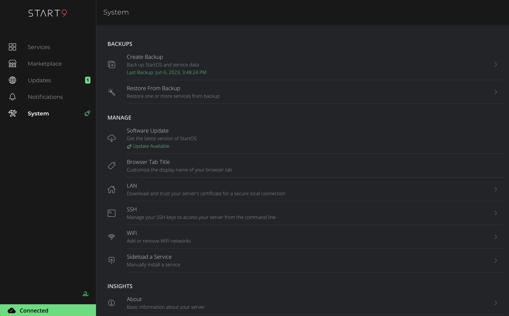

# StartOS

### _Welcome to the era of Sovereign Computing_ ###

StartOS is a Debian-based Linux distro optimized for running a personal server. It facilitates the discovery, installation, network configuration, service configuration, data backup, dependency management, and health monitoring of self-hosted software services.

## Running StartOS
There are multiple ways to get your hands on StartOS.

### :moneybag: Buy a Start9 server
This is the most convenient option. Simply [buy a server](https://store.start9.com) from Start9 and plug it in.

### :construction_worker: Build your own server
This option is easier than you might imagine, and there are 4 reasons why you might prefer it:
1. You already have hardware
1. You want to save on shipping costs
1. You prefer not to divulge your physical address
1. You just like building things

To pursue this option, follow one of our [DIY guides](https://start9.com/latest/diy).

## :heart: Contributing
There are multiple ways to contribute: work directly on StartOS, package a service for the marketplace, or help with documentation and guides. To learn more about contributing, see [here](https://start9.com/contribute/).

## UI Screenshots

