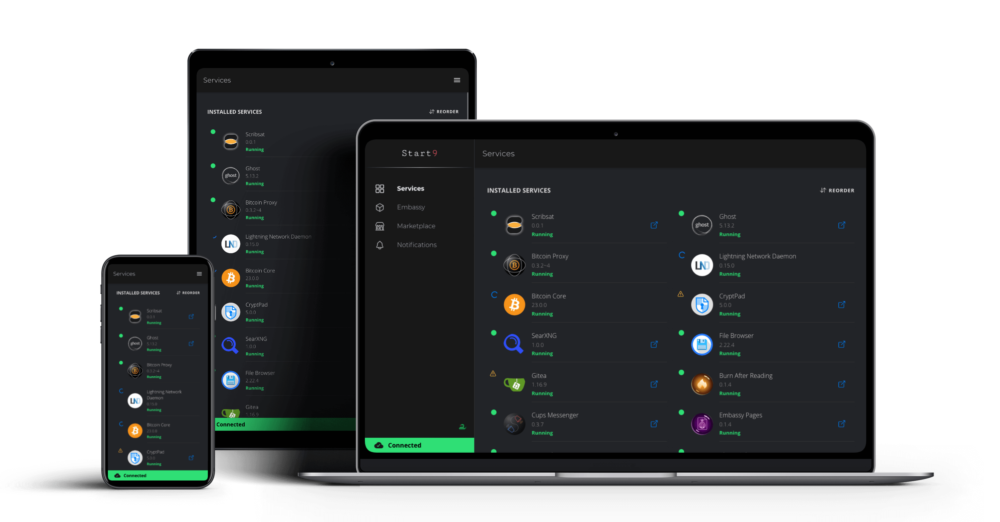
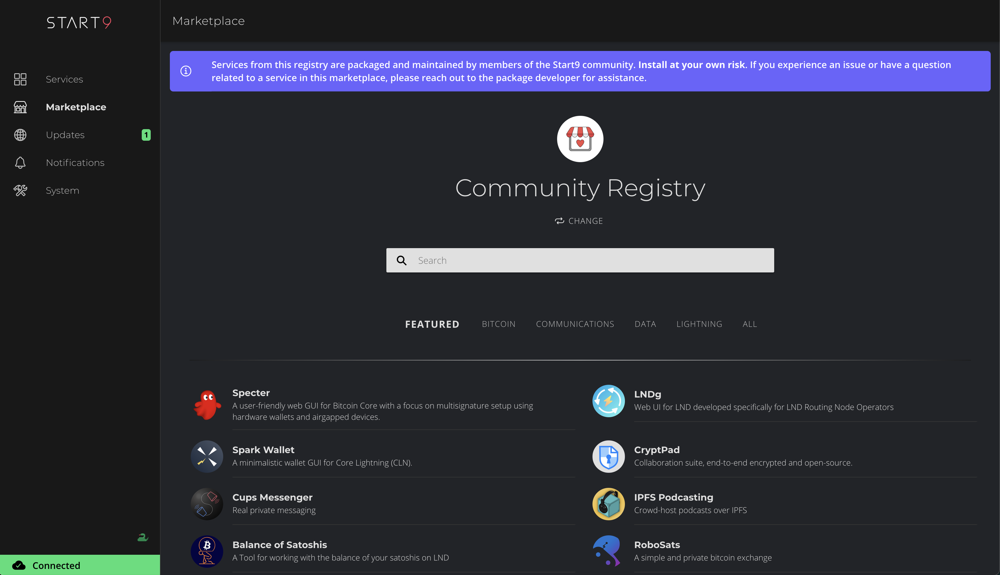

  
  <h1 style="margin-top: 0;">StartOS</h1>
  
  
    
  
  
  
  
  
  
  

 

  <h3>
    Welcome to the era of Sovereign Computing
  </h3>
  

    StartOS is an open source Linux distribution optimized for running a personal server. It facilitates the discovery, installation, network configuration, service configuration, data backup, dependency management, and health monitoring of self-hosted software services.
  

 

 

## Running StartOS
> [!WARNING]
> StartOS is in beta. It lacks features. It doesn't always work perfectly. Start9 servers are not plug and play. Using them properly requires some effort and patience. Please do not use StartOS or purchase a Start9 server if you are unable or unwilling to follow instructions and learn new concepts.

### 💰 Buy a Start9 server
This is the most convenient option. Simply [buy a server](https://store.start9.com) from Start9 and plug it in.

### 👷 Build your own server
This option is easier than you might imagine, and there are 4 reasons why you might prefer it:
1. You already have hardware
1. You want to save on shipping costs
1. You prefer not to divulge your physical address
1. You just like building things

To pursue this option, follow one of our [DIY guides](https://start9.com/latest/diy).

## ❤️ Contributing
There are multiple ways to contribute: work directly on StartOS, package a service for the marketplace, or help with documentation and guides. To learn more about contributing, see [here](https://start9.com/contribute/).

To report security issues, please email our security team - security@start9.com.

## 🌎 Marketplace
There are dozens of services available for StartOS, and new ones are being added all the time. Check out the full list of available services [here](https://marketplace.start9.com/marketplace). To read more about the Marketplace ecosystem, check out this [blog post](https://blog.start9.com/start9-marketplace-strategy/)

## 🖥️ User Interface Screenshots

